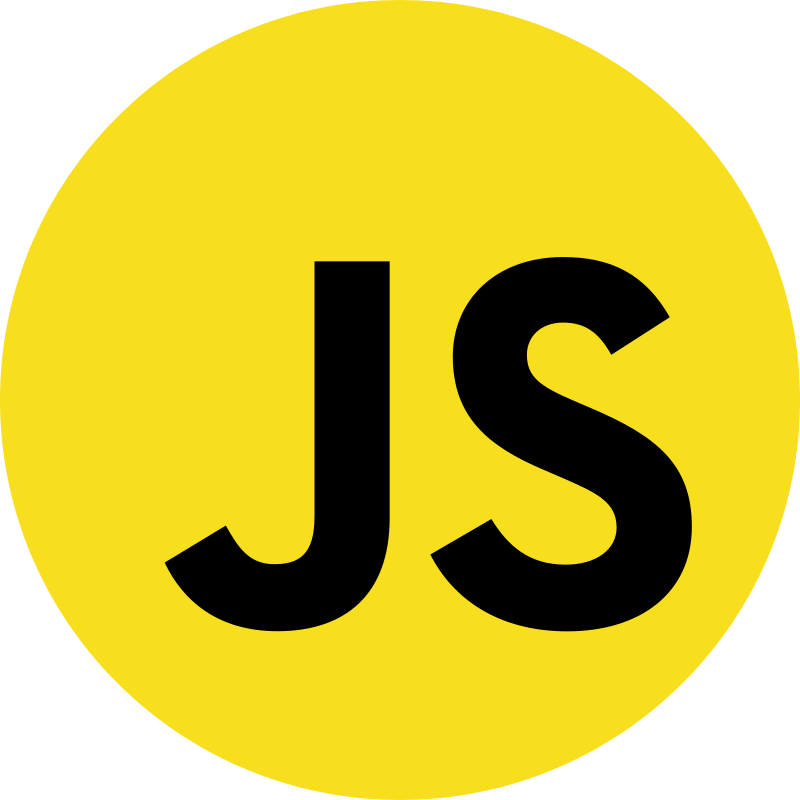

<h1>📞 Alô</h1>
Apenas um estudante de programação

  <a href="https://github.com/vitu1928">
  
  

<h2>Tenho experiência</h2>
<ul type="none">
  <li> <h3>  Javascript</h3>
  <li> <h3>  NodeJS</h3>
  <li> <h3>  HTML</h3>
  <li> <h3>  CSS</h3>
  <li> <h3>  mongogdb</h3>
</ul>
<h2>Estudando</h2>
<ul type="none">
  <li> <h3>  ReactJS</h3>
  <li> <h3>  MySQL</h3>
  <li> <h3>  C</h3>
</ul>
